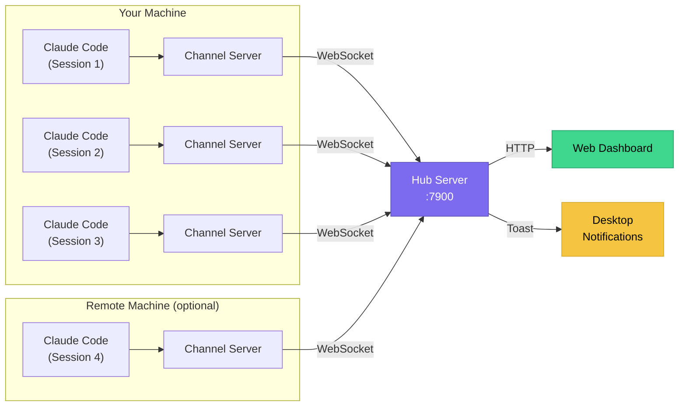
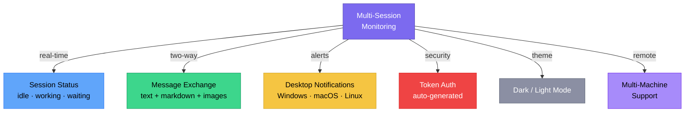
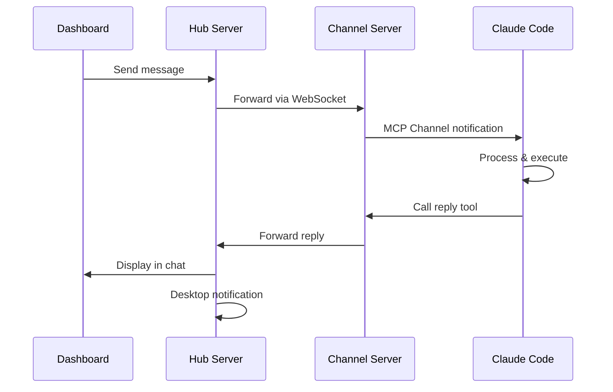
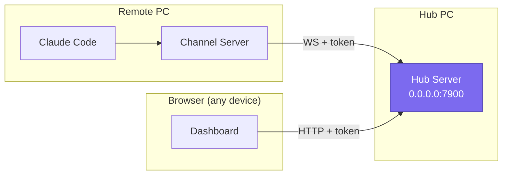

# claude-alarm

> Multi-session monitoring dashboard for Claude Code via MCP Channels

Monitor and interact with multiple Claude Code sessions from a web dashboard. Get desktop notifications when tasks complete, send messages to Claude, and track session status.

## Architecture



## Features



## Quick Start

### 1. Install

```bash
npm install -g @delt/claude-alarm
```

### 2. Start the Hub

```bash
claude-alarm hub start
```

### 3. Initialize Project

```bash
cd your-project
claude-alarm init
```

### 4. Run Claude Code

```bash
claude --dangerously-load-development-channels server:claude-alarm
```

### 5. Open Dashboard

Open `http://127.0.0.1:7900` in your browser.

## Message Flow



## Dashboard Layout

```
┌─────────────────────────────────────────────────────────────┐
│  Claude Alarm                              ☽  ● Connected  │
├──────────────┬──────────────────────┬───────────────────────┤
│  SESSIONS    │  Messages            │  NOTIFICATIONS        │
│              │                      │                       │
│ ┌──────────┐ │  ┌─────────────────┐ │  ┌─────────────────┐ │
│ │ my-app   │ │  │ Claude · 14:30  │ │  │ ● Task complete │ │
│ │ idle     │ │  │ Build succeeded │ │  │   my-app · 14:30│ │
│ └──────────┘ │  └─────────────────┘ │  └─────────────────┘ │
│ ┌──────────┐ │                      │  ┌─────────────────┐ │
│ │ api-svc  │ │       ┌────────────┐ │  │ ● Error found   │ │
│ │ working  │ │       │ You · 14:31│ │  │   api-svc · 14:2│ │
│ └──────────┘ │       │ Fix the bug│ │  └─────────────────┘ │
│ ┌──────────┐ │       └────────────┘ │                       │
│ │ frontend │ │                      │                       │
│ │ waiting  │ │                      │                       │
│ └──────────┘ │                      │                       │
├──────────────┴──────────────────────┴───────────────────────┤
│  📎 [Message input...  Shift+Enter ↵]           [ Send ]   │
└─────────────────────────────────────────────────────────────┘
```

## CLI Commands

| Command | Description |
|---------|-------------|
| `claude-alarm init` | Setup project and show next steps |
| `claude-alarm hub start [-d]` | Start hub server (`-d` for daemon) |
| `claude-alarm hub stop` | Stop hub daemon |
| `claude-alarm hub status` | Show hub status |
| `claude-alarm token` | Show auth token |
| `claude-alarm test` | Send test notification |

## Tools Available to Claude

| Tool | Description |
|------|-------------|
| `notify` | Send a desktop notification (title, message, level) |
| `reply` | Send a message to the dashboard |
| `status` | Update session status (idle, working, waiting_input) |

## Configuration

Config stored at `~/.claude-alarm/config.json`:

```json
{
  "hub": {
    "host": "127.0.0.1",
    "port": 7900,
    "token": "auto-generated-uuid"
  },
  "notifications": {
    "desktop": true,
    "sound": true
  },
  "webhooks": []
}
```

### Custom Session Names

```json
{
  "mcpServers": {
    "claude-alarm": {
      "command": "npx",
      "args": ["-y", "@delt/claude-alarm", "serve"],
      "env": {
        "CLAUDE_ALARM_SESSION_NAME": "my-project"
      }
    }
  }
}
```

### Webhooks

```json
{
  "webhooks": [
    {
      "url": "https://hooks.slack.com/services/...",
      "headers": { "Content-Type": "application/json" }
    }
  ]
}
```

## Remote Access



1. Set host to `0.0.0.0` in `~/.claude-alarm/config.json`
2. Open port 7900 in your firewall
3. On remote machine: `claude-alarm init` → select remote hub (Y)

```json
{
  "mcpServers": {
    "claude-alarm": {
      "command": "npx",
      "args": ["-y", "@delt/claude-alarm", "serve"],
      "env": {
        "CLAUDE_ALARM_HUB_HOST": "your-server-ip",
        "CLAUDE_ALARM_HUB_PORT": "7900",
        "CLAUDE_ALARM_HUB_TOKEN": "your-token"
      }
    }
  }
}
```

## Image Upload (Local Sessions)

Send images to Claude via the dashboard:
- **Ctrl+V** — Paste from clipboard
- **Drag & Drop** — Drop image onto message area
- **Attach button** — Click 📎 to browse files

> Images are only available for local sessions (same machine as Hub). Max 10MB, auto-deleted after 5 minutes.

## Platform Support

| Platform | Notifications | Engine |
|----------|:---:|--------|
| Windows | ✓ | SnoreToast |
| macOS | ✓ | terminal-notifier |
| Linux | ✓ | notify-send |

## Requirements

- Node.js >= 18
- Claude Code with MCP Channels support

## License

MIT
